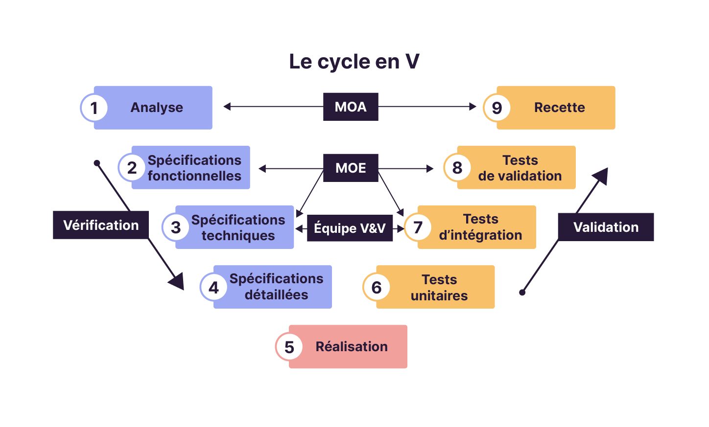

# Rappels des concepts de la POO

POO = Programmation orientée objet
PP = Programmation procédurale

## Les classes

Les classes sont une représentation d'objets réels ou conceptuels (ex. : signes astrologiques).

Cette représentation est possible grâce à la création d'un plan ou d'un modèle, et permet de se concrétiser en créant des objets à partir de ceux-ci.

Les classes permettent donc de décrire des objets, puis d'en créer.

Les classes définissent également des **types** et permettent donc de **typer** des éléments.

### De quoi est composée une classe ?

Une classe est composée d'un ensemble de _caractéristiques_. Celles-ci se présentent sous forme de **variables** qu'on appelle des **attributs** dans le contexte objet. On les appelle aussi des **propriétés**.

Une classe dispose aussi d'un _comportement_ qui représente ce que les objets issus de la classe pourront faire.

Ce _comportement_ est constitué de **fonctions** qu'on appelle dans le contexte objet des **méthodes**.

Ces méthodes représentent des actions que peuvent réaliser les objets créés à partir de la classe.

----------

## Objet

Les objets sont aussi appelés des instances _concrètes_ (ou aussi instances de classes) et sont créés à partir des classes.

Le fait de créer un objet s'appelle : **l'instanciation**.

Un objet à un instant donné dispose d'un **État** : c'est ce qui regroupe l'ensemble des caractéristiques réelles de l'objet. En clair, il s'agit des valeurs réelles des attributs de l'objet à un instant donné.

Un objet peut aussi être appelé une **Entité** lorsque l'objet lui-même est directement lié au domaine métier. L'exemple le plus courant que vous utilisez régulièrement est : le modèle (architecture MVC).


### Le cycle de vie d'un objet

#### 1. Création / instanciation

L'objet est instancié souvent à partir d'un mot-clé propre au langage de programmation.

La création d'un objet déclenche automatiquement et systématiquement son **constructeur**. 

Le constructeur est une méthode qui - même si elle n'est pas définie explicitement - est exécutée.

Le constructeur permet de définir les caractéristiques d'un objet.

#### 2. Utilisation & modification de l'état

Une fois l'objet créé, on peut s'en servir en accédant à ses _caractéristiques_ et en exploitant ses **méthodes**.

Son utilisation entraine souvent la modification de son état, puisque les méthodes sont souvent basées dessus.

#### 3. Destruction

Lorsque l'objet n'a plus d'utilité, il est détruit. Plusieurs cas de figure en fonction du contexte : 

- `Dans le cadre d'une application web` : La durée de vie des objets est directement corrélée aux pages sur lesquelles ils sont utilisés. Cela signifie donc qu'à chaque changement de page les objets sont détruits.
- `Dans le cadre d'un logiciel` : C'est souvent le **Garbage Collector** (_Collecteur de Déchets_) qui s'occupe de détruire les objets qui ne sont plus utilisés pour libérer de la mémoire (RAM).

Dans tous les cas, il est possible de supprimer des objets manuellement.


----------

## Encapsulation

Le principe de l'encapsulation est de résoudre la problématique que tout le monde puisse faire ce qu'il veut dans le code.

Sans encapsulation, n'importe qui peut modifier : 

- n'importe quoi ;
- n'importe quand ;
- n'importe où ;
- n'importe comment ;

Et donc les données sont accessibles partout, sans restriction et sans règle commune.

Les problèmes qui peuvent découler de cette situation sont : 

- les erreurs ne sont pas bloquées (car vous ne limitez pas l'accès)
- les erreurs s'accumulent silencieusement
- vous ne savez pas d'où proviennent les erreurs - elles sont souvent loin de leur cause

Le principe qui en découle est de restreindre l'accès aux caractéristiques et aux méthodes, et on n'autorise que ce qui est nécessaire, et de manière contrôlée.

> Restreindre ne signifie pas bloquer, mais guider

En découle une problématique : Vous avez des objets avec des données et un état, et vous devez les lire et les modifier.

### La visibilité

On distingue 3 types de visibilité : 

1. `public` : l'accès se fait de partout
2. `protected` : l'accès se fait depuis la classe courante et les classes enfant
3. `private` : l'accès se fait uniquement dans la classe

On parle d'**API publique de classe** pour regrouper tous les éléments publics d'une seule et même classe.

### Les Getters et les Setters

Ils permettent respectivement de consulter et de modifier des données de manière contrôlée.

Le `getter` permet la consultation sans autoriser la modification de la donnée.

Le `setter` permet la modification de la donnée, sans la consultation. Il permet par ailleurs de vérifier des contraintes, transformer des valeurs, refuser des modifications voire de déclencher des effets de bord.

Exemple : <a href="exemples/getter_setter.php">fichier getter_setter.php</a>

> On n'expose jamais une donnée, on expose une manière de l'utiliser.

----------

## Héritage

Les problèmes de départ qui font que l'héritage a été créé : 

- éviter la duplication de code
- partager ce qui est commun
- comment autoriser des comportements spécifiques

Un principe de base : On va disposer de **classes "parent"** et de **classes "enfant"**. La classe enfant va "hériter" de certains comportements et certaines caractéristiques de la classe parent.

Cela entraine une notion de dépendance de la classe enfant vis-à-vis de la classe parent.

⚠️ ça veut donc dire que toute modification sur un parent peut entraîner des effets de bord (incluant des bugs :/ ) dans les classes enfant.

On peut donc dire aussi qu'une classe enfant est un type "spécialisé" de la classe parent.

### Ce que permet l'héritage

1. La récupération de ce qui est commun
    - caractéristiques
    - comportements
2. Cela permet d'étendre un comportement ou des caractéristiques
    - On peut créer de nouveaux attributs
    - On peut créer de nouvelles méthodes
    - On peut donc définir de nouvelles règles
3. Cela permet d'adapter un comportement
    - on va réaliser la même action que chez le parent
    - MAIS pas de la même manière
    - On appelle ça une **surcharge** ou un **override**

### La surcharge ou l'Override

On redéfinit une méthode héritée pour modifier son comportement : 
- même action
- même intention
- MAIS une **logique interne différente**.

### Le polymorphisme

Le polymorphisme est la capacité pour plusieurs classes d'exposer les mêmes méthodes, avec les mêmes intentions respectives, mais avec des comportements différents.

Il est rendu possible grâce à la **surcharge** (ou à **l'override**).

> On ne peut donc pas simplifier le fait de dire "j'ai utilisé une surcharge de méthode, donc j'ai fait du polymorphisme".

Ce qui est par contre vrai, et lexicalement correct : 

- La surcharge (ou l'override) constitue le **mécanisme**
- Le polymorphisme est le **résultat observable**

Schéma simple mental à retenir : 

- Héritage -> structure
- La surcharge -> adaptation
- Polymorphisme -> utilisation uniforme

Exemple : <a href="exemples/polymorphisme.php">fichier polymorphisme.php</a>

## Abstraction

L'idée de base, c'est qu'avant de coder des classes, et pour avoir un système bien conçu, on a besoin de : 

- lister ce qui doit exister
- toujours définir ce qui va être fait et comment
- imposer des règles communes
- devoir absolument rester libre de l'implémentation.

Le "défi" qui en découle : comment fait-on pour guider la structure de notre code, tout en laissant la possibilité d'implémenter ce que l'on veut ?

> L'abstraction consiste donc à définir un cadre et des obligations sans entrer dans les détails de l'implémentation.

Dit autrement on décrit l'intention, et non l'exécution.

### Classe Abstraite

Une **classe Abstraite** est une classe qui _ne peut pas être instanciée_, elle peut être _partiellement implémentée_, et qui sert de **base commune**.

Son rôle est donc de factoriser des comportements communs, imposer une structure, fournir des règles de base et éviter les implémentations incohérentes.

Ce qu'elle peut contenir : 

- des caractéristiques ;
- des méthodes abstraites (sans logique) ;
- des méthodes concrètes (avec logique) ;

Quand doit-on utiliser une classe abstraite ?

- La question se pose lorsque l'on parle d'héritage ;
- lorsque l'on a un lien fort entre les classes ;
- Lorsqu'elles partagent un(des) comportement(s) ;
- Lorsque l'on doit mettre en place ou définir un cadre commun.

Exemple : <a href="exemples/classe_abstraite.php">fichier classe_abstraite.php</a>


### Interface

Une interface est un **contrat pur**.

Autrement dit, c'est une classe abstraite, sans possibilité de méthode concrète, ni de caractéristiques. Le but est donc de décrire un **comportement**.

Elle impose ce qui doit exister, mais pas la façon de le faire.


Quand doit-on choisir de faire une interface ?

- Lorsque les classes sont très différentes
- Lorsqu'on veut uniquement un contrat
- Quand on veut éviter un héritage trop fort
- Quand on veut prévoir plusieurs implémentations

## Quoi choisir et quand ?

- Interface -> définir ce qui doit être fait
- Classe Abstraite -> définir une base **partielle**
- Classe concrète -> définir le comportement réel


**Tableau comparatif**

| Situation                 | Classe abstraite | Interface |
|---------------------------|------------------|-----------|
| Classes proches           | ✅               | ❌        |
| Partage de logique        | ✅               | ❌        |
| Structure imposée         | ✅               | ❌        |
| Classes très différentes  | ❌               | ✅        |
| Plusieurs héritages       | ❌               | ✅        |
| Contrat pur               | ❌               | ✅        |


**Une autre manière de dire**

> Interface lorsque l'on veut imposer un comportement, et classe abstraite lorsque l'on veut imposer une structure.

# Principes importants

## Couplage

La notion de couplage représente le niveau de dépendance entre plusieurs classes.

On distingue le **couplage faible**, qui représente une dépendance à une abstraction (interface par exemple) et le **couplage fort** lorsqu'une classe dépend directement de l'implémentation d'une autre classe.

Exemple de couplage fort

```php
class OrderService {
    private MysqlDatabase db = new MysqlDatabase();
}
```

Exemple de couplage faible

```php
class OrderService {
    private Database db;

    OrderService(Database db) {
        this.db = db;
    }
}
```

> Vous devez arriver à un couplage le plus faible possible dans tout votre code.

# Principe SOLID

SOLID, c'est 5 principes de bon sens qui permettent d'avoir un code facilement compréhensible, évolutif et facile à maintenir.

- (S) : SRP - Single Responsibility Principle
- (O) : Open / Close Principle
- (L) : Liskov Susbstitution Principle
- (I) : Interface Segregation Principle
- (D) : Dependency Injection Principle

## SRP - Single Responsibility Principle

Une classe, comme n'importe quel élément d'un code, ne doit avoir qu'une seule et unique responsabilité. Cela signifie qu'elle ne devra faire qu'une seule chose, mais le faire bien.

On parle de "SRP" pour "Single Responsibility Principle" (ou _Principe de Responsabilité Unique_), qui est la première règle à appliquer lors de développement SOLID.

On appelle ça aussi le "SoC" pour "Separation of Concerns" (ou _Séparation des responsabilités_).

Le fait de repsecter la distinction des reponsabilité va permettre de simplifier : 

- Le refactoring
- La testabilité
- L'organisation du code en général
- La réutilisabilité du code
- La lecture / compréhension du code

On parle également de **cohésion**. Le respect du SoC ou SRP implique obligatoirement une cohésion **forte** de votre classe et de ce qui la compose.

Si la cohésion est trop faible, un bon indicateur est souvent que vous aurez du mal à la nommer. On parle alors de cohésion **faible**.

## Open / Close Principle

> Ce principe dit que un code doit être ouvert à l'extension, mais fermé à la modification.

ça reprend ce que l'on a vu depuis le début : toute modification sur un code existant est risque majeur de créer des failles ou des bugs.

Il vaut donc mieux étendre les comportements existants, plutôt que de les modifier.

Exemple : <a href="exemples/ocp.php">fichier ocp.php</a>

## Liskov Susbstitution Principle

> Tout objet d'un type donnée doit pouvoir être remplacé par un de ses sous-types sans casser le programme.

Le principe de substitution de Liskov induit que les comportement qui ne peuvent pas être partagé entre plusieurs classes doivent être séparés par SRP (par responsabilité) et introduit via des interfaces comportementales.

Exemple : <a href="exemples/liskov.php">fichier liskov.php</a>

## Interface Segregation Principle

Un client ne doit pas être forcé de dépendre de méthodes qu'il n'utilise pas.

Le principe est donc de séparer les interfaces par responsabilité.

L'objectif est donc que chaque classe implémente uniquement ce qu'elle utilise, soit plus lisible et plus simple à maintenir.

Le typage devient intelligent, mais surtout **prévisible**.

Exemple : <a href="exemples/isp.php">fichier isp.php</a>

## Dependency Inversion Principle

L'inversion de dépendance, c'est quand on inverse les dépendances. Exemple : 

```txt
OrderService → SmtpMailer
```

on inverse les dépendances : 

```txt
OrderService → MailerInterface ← SmtpMailer
```

Le mécanisme utilisé pour réaliser l'inversion de dépendance est l'injection de dépendance (_Dependency Injection_ ou _DI_)

Qu'est-ce qu'on peut retrouver en dépendance dans un code ?

- des bases de données
- Services
- Cache
- API externes

Si on code quelque chose de simple pour commencer = 

```php
class UserService {
    private UserRepository repo = new UserRepository();
}
```

Les problèmes qu'on peut soulever de ce code : 

1. on a un couplage extrêmement fort à `UserRepository`
    - impossibilité de changer de base de données sans modifier `UserService`
    - impossibilité d'utiliser une autre implémentation car dépendance à un détail technique (classe) plutôt qu'un contrat (interface).
2. Tests unitaires quasiment impossible
    - `new UserRepository()` est instancié en dur
    - pas de mock (possible)
3. on a un mélange des responsabilités
    - gère la logique des utilisateurs `UserService`
    - Gère la création des dépendances de cette classe.

C'est là qu'intervient l'injection de dépendance.

L'injection de dépendance (ou DI pour _Dependency Injection_) est le fait d'injecter une dépendance à une classe via un paramètre plutôt que de l'instancier directement dans cette classe.

```php
<!-- Ancien code  -->
class UserService {
    private UserRepository $repo = new UserRepository();
}

<!-- Nouveau code avec DI -->
class UserService {
    private UserRepository $repo;

    public function __construct(UserRepository $repo) {
        $this->repo = $repo;
    }
}
```

Les avantages : 

- `UserService` ne connaît pas l'implémentation du repo
- il dépend d'un contrat via le typage fort qui est utilisé sur `UserRepository`
- Quelqu'un d'autre se charge de l'instanciation.

> 🖕 L'injection de dépendance n'est pas un design pattern, c'est une façon de concevoir le code.

----------

# Rappels sur les tests

## A quoi servent les tests ?

- Vérifier le bon fonctionnement d'une application
- Vérifier la non régression d'un projet

Les tests utilisent des assertions pour vérifier la véracité d'une chose. (Une assertion est une proposition que l'on avance et que l'on soutient comme vraie.)

## Quels types de tests existe-t-il ?

- `manuels` : vous les faites tous les jours à la main quand vous faites du développement
- `Unitaires` : on teste un comportement simple, unitaire, souvent sans aucune dépendance.
- `Fonctionnels / Intégration` : on teste un ensemble d'unités.
- `End-to-End / de bout en bout / Validation` : On simule un comportement d'utilisateur réel.
- `performance / montée en charge` : permet de vérifier la stabilité
- `sécuritaire` : la sécurité...




----------


----------

TESTS MOCKS

TDD/TEST + comparatif cycle V

Design patterns

Composition / Agregation

Static

Final