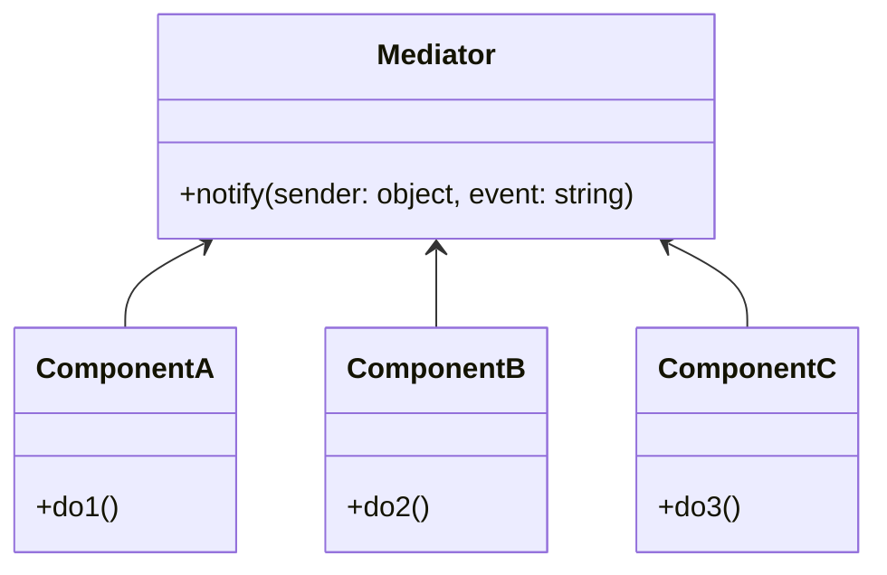
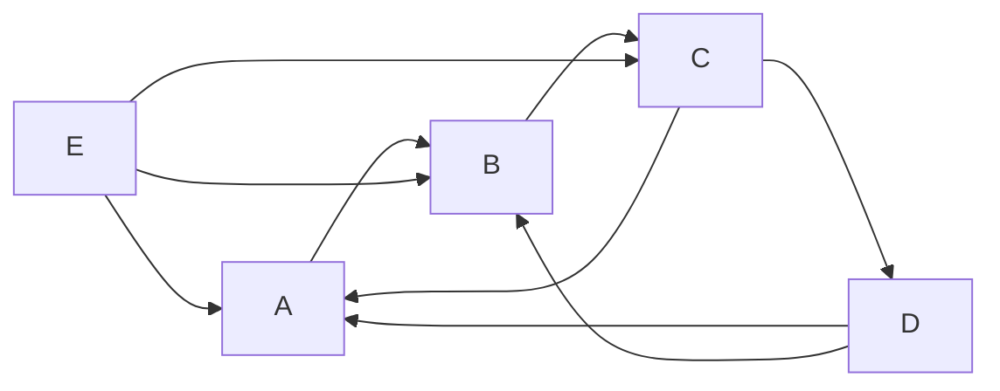
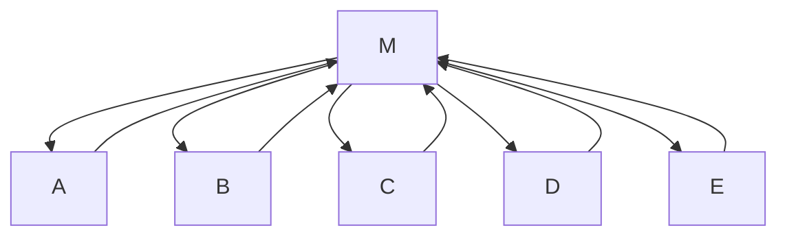

# Mediator

## Explication

**Mediator** désigne un **design pattern comportemental** (*behavioral design pattern*). Le **médiateur** est une classe qui a pour responsabilité de gérer les interactions entre d'autres classes, ici appelées **composants** (*components*). Celle-ci agit comme *chef d'orchestre*, permettant de réduire les dépendances entre les composants et de centraliser la logique de communication. Ainsi, les composants n'ont plus besoin de communiquer entre eux.

## Besoin

Dans un système complexe, les composants peuvent être fortement **couplés**, ce qui rend le code difficile à maintenir, à faire évoluer, et les composants sont plus difficilement réutilisables.

Ces systèmes, schématisés, prennent une forme "*spaghetti*" :

## Implémentation

La solution consiste à introduire une classe **Médiateur** qui gère les interactions entre les composants. Les **composants** communiquent uniquement avec le médiateur, qui se charge de transmettre les *messages* et de coordonner les *actions*.

Les systèmes, schématisés, prennent alors une forme plus structurée avec un **médiateur** qui *centralise la communication* :

Le Mediator pattern est surtout utile pour les systèmes qui
- ont des classes fortement couplées à d'autres classes qui interagissent entre elles
- ont des classes qui ne sont pas ou peu réutilisables à cause de leur couplage, forçant la création de classes proches

## Limitations

>⚠️ Le médiateur peut devenir un **God object**, c'est à dire une classe qui connaît et gère tout. Ces classes deviennent difficiles à comprendre, même si elles respectent le principe de responsabilité unique sur papier. Une classe trop volumineuse doit malgré tout être fragmentée.

## Démonstration

[Code de démonstration](./MediatorDemo.cs)

## Sources

https://refactoring.guru/design-patterns/mediator
https://en.wikipedia.org/wiki/God_object
